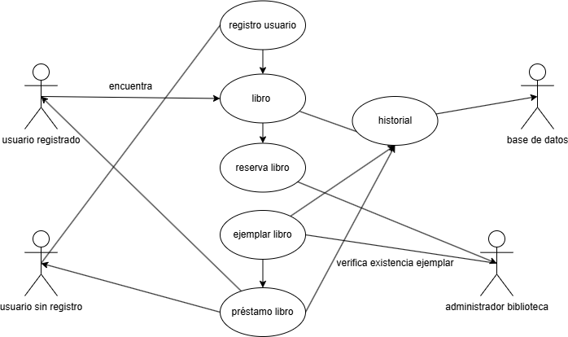

# 📚 Sistema de Gestión de Biblioteca 🏛

Aplicación web desarrollada con **Flask** (backend) y **HTML/CSS/JavaScript** (frontend), diseñada para administrar eficientemente una biblioteca: libros, ejemplares, préstamos, reservas y usuarios.

---

## 🌟 Características principales

- ✅ Gestión completa de libros (CRUD)
- 📦 Control de ejemplares y su disponibilidad
- ⏳ Sistema de préstamos con fechas y devoluciones
- 📅 Reservas de libros
- 👤 Gestión de usuarios
- 🕓 Historial detallado de todas las operaciones
- 🧭 Interfaz intuitiva con navegación por pestañas
- 🔍 Filtros avanzados en todas las secciones

---

## 🧰 Tecnologías utilizadas

### 🔧 Backend
- **Flask** – Microframework web en Python.
- **Flask-CORS** – Soporte para Cross-Origin Resource Sharing.
- **PyMongo** – Cliente oficial para MongoDB.
- **MongoDB** – Base de datos NoSQL.

### 🎨 Frontend
- **HTML5**
- **CSS3**
- **JavaScript (Vanilla)**

---

## 📁 Estructura del proyecto


    biblioteca/ 
    |
    ├── formulario.html # Interfaz principal                                      
    ├── editar.html # Página para editar registros                                                                           
    ├── formulario.py # Servidor Flask                                                                           
    └── estilo.css # Estilos personalizados


## ⚙️ Instalación y configuración

### 1. Requisitos
- Python 3.7+
- MongoDB instalado y ejecutándose localmente
- pip (gestor de paquetes de Python)

### 2. Instalar dependencias
```bash
pip install flask flask-cors pymongo
```

### 3. Configurar MongoDB
- MongoDB debe estar activo en `mongodb://localhost:27017/`
- Se creará automáticamente la base de datos `biblioteca`

### 4. Ejecutar la aplicación
```bash
python formulario.py
```

### 5. Acceder a la app
Navegar a: `http://localhost:5000/formulario.html`

---

## 🧑‍💻 Uso de la aplicación

La interfaz está dividida en pestañas:

1. 📘 **Libros**: Gestión y registro.
2. 📕 **Ejemplares**: Control físico de libros.
3. 🔁 **Historial**: Registro de operaciones.
4. 📤 **Préstamos**: Entrega y devolución de libros.
5. ⏳ **Reservas**: Administración de reservas.
6. 👥 **Usuarios**: Registro y edición de usuarios.

---
## 🗂️ Diagrama de Casos de Uso

Este diagrama ilustra las interacciones entre los distintos actores y funciones del sistema.



---
## 📝 Ejemplo: Registro de préstamo (JavaScript)

```javascript
document.getElementById('form-prestamo').addEventListener('submit', async function(e) {
  e.preventDefault();
  const formData = new FormData(this);

  try {
    const response = await fetch('http://localhost:5000/add_prestamo', {
      method: 'POST',
      body: formData
    });

    if (!response.ok) throw new Error('Error al registrar préstamo');

    alert('Préstamo registrado correctamente');
    this.reset();
    cargarDatos('Prestamos');
  } catch (error) {
    console.error('Error:', error);
    alert('Error: ' + error.message);
  }
});
```

---

## 🔌 Endpoints del Backend

### 📚 Libros
- `GET /libros` – Obtener todos los libros
- `POST /add_libro` – Crear nuevo libro
- `PUT /libros/<id>` – Actualizar libro
- `DELETE /libros/<id>` – Eliminar libro

### 📤 Préstamos
- `POST /add_prestamo` – Registrar préstamo
- `POST /devolver_prestamo/<id>` – Registrar devolución

### 👥 Usuarios
- `POST /add_usuario` – Agregar usuario
- `GET /usuarios` – Obtener todos los usuarios

### 🔁 Historial
- `GET /historial` – Obtener historial completo

---

## ❓ ¿Por qué estas tecnologías?

- **Flask**: Sencillo, rápido y poderoso para APIs REST.
- **MongoDB**: Flexible, ideal para esquemas dinámicos.
- **JavaScript Vanilla**: Ligero, sin dependencias externas.

---

## 🤝 Contribución

¡Las contribuciones son bienvenidas!

1. Haz un **fork** del repositorio.
2. Crea una rama nueva:
   ```bash
   git checkout -b feature/NuevaFeature
   ```
3. Realiza cambios y haz commit:
   ```bash
   git commit -m "Agrega nueva feature"
   ```
4. Sube tu rama:
   ```bash
   git push origin feature/NuevaFeature
   ```
5. Abre un Pull Request 🚀

---

## 📄 Licencia

Este proyecto está bajo la **Licencia MIT**. Consulta el archivo `LICENSE` para más detalles.

---

## 📬 Contacto

¿Dudas o sugerencias? Hecho con ❤️ por Daniel Lozano | Correo: daniellozanocuervo@gmail.com GitHub: Danielle2101

